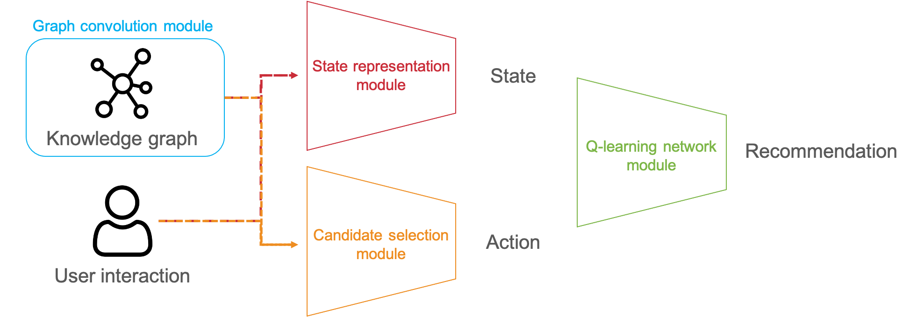

# KGQR
<br/>


<br/><br/><br/>
Framework for interactive recommendation system based on reinforcement learning taking leverage of knowledge graph

**Contents table**
1. [Baseline - KGQR](#baseline)
2. [How to start?](#start)
2. [File Tree](#filetree)
<br/><br/>


## Baseline - KGQR <a name="baseline"></a>
KGQR is the first trial to use knowledge graph prior on interactive recommendation system based on reinforcement learning. 

["Interactive Recommender System via Knowledge
Graph-enhanced Reinforcement Learning"](https://arxiv.org/pdf/2006.10389.pdf)
<br/><br/>


## How to start? <a name="start"></a>
1. Download [ratings.csv](https://grouplens.org/datasets/movielens/20m/) to raw_data folder. 

    In raw_data folder, there should be ratings.csv, kg.txt, item_index2enity_id.txt files
  
2. Preprocess rating file and knowledge graph file

    This will generate data folder and sorting.csv 
     ```shell script
        python preprocess.py  
     ```
3. Train the model 
     ```shell script
        python train.py 
     ```


## File Tree (After preprocessing) <a name="filetree"></a>
- `raw_data`
  - `movie`
    - `kg.txt`: knowledge graph file;
    - `ratrings.csv`: raw rating file of Movielens-20M dataset;
    - `item_index2entity_id.txt`: the mapping 3from item indices in the raw rating file to entity IDs in the KG;
    - `sorted.csv(generated by preprocess.py)`: sorted (by user id and timestamp) rating file of Movielens-20M dataset;
    
- `data(generated by preprocess.py)`: preprocessed files
  - `movie`
    - `*_vocab.pkl`: Change indicators in raw_data files to index used in this project
    - `n_hop_kg.pkl`: save entity's ids in 2 hop;
        ```python
          n_hop_kg.pkl[entity_id][1] = list of 1-hop entity ids
          n_hop_kg.pkl[entity_id][2] = list of 2-hop entity ids
        ```  
    - `kg_adj_mat.npy`: Knowledge graph's adjacent nodes information;   
    - `*_data_dict.pkl`: can refer user's rating history sorted in chronological order by user_id;
